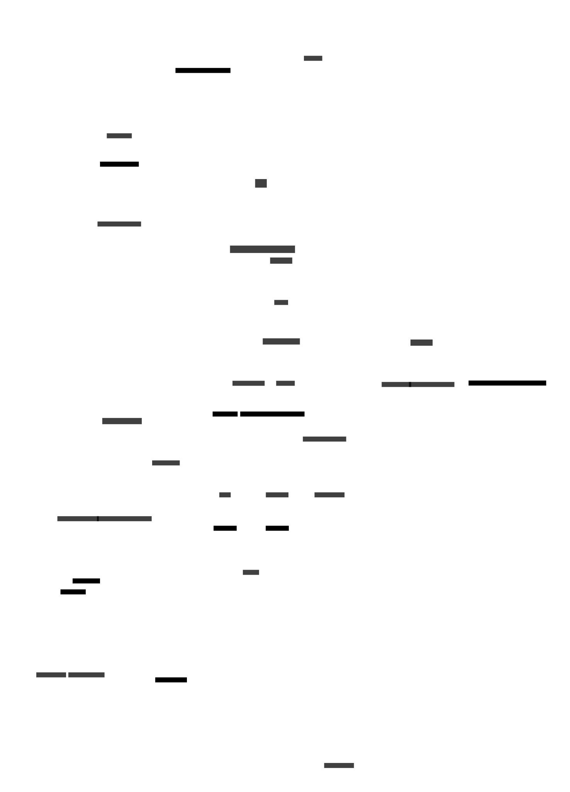

# micro-infra

micro-infra is a lightweight, cloud-native infrastructure designed to manage and deploy microservices.
Deployed in GCP due to GKE Control Plain regional free tier.

```shell
micro-infra/
├── docs/                                 # Documentation files
├── gitops/                               # GitOps resources for ArgoCD
├── iac/                                  # Infrastructure-as-Code with Terragrunt
├── meta-charts/                          # Meta Helm charts for for gitops
├── repo-operator/                        # Repository operator for managing and automating workflows
├── runbooks                              # Runbooks for operations and alerts
└── scripts                               # Automation scripts for repo scope
```

## Architecture Overview

The infrastructure is organized into distinct namespaces, each serving a specific purpose.
Below is the architecture diagram illustrating the components and their interactions:



## Key Components

### Observability

Tools and services for Monitoring and Telemetry data collection and storage.

- **Grafana**: Provides dashboards and visualizations for metrics and logs.
- **Tempo**: A distributed tracing backend compatible with OpenTelemetry.
- **OpenTelemetry Collector**: Collects and exports telemetry data (metrics, logs, traces) to backends.
- **Prometheus Operator**: Manages Prometheus instances for monitoring Kubernetes clusters.
- **Prometheus**: Time-series database for storing metrics.
- **AlertManager**: Handles alerts sent by Prometheus and routes them to appropriate channels.

### Infrastructure

Core components that support the cluster's operations.

- **Cert-Manager**: Automates the management and issuance of TLS certificates.
- **Cluster Autoscaler**: Automatically adjusts the number of nodes in the cluster based on resource utilization.
- **Ingress NGINX**: Manages external HTTP/S traffic and load balancing within the cluster.

### Platform

Deployment and continuous integration/continuous deployment (CI/CD) solutions.

- **ArgoCD**: A declarative, GitOps continuous delivery tool for Kubernetes.

### Products

This namespace is reserved for deploying user-defined microservices and applications.

